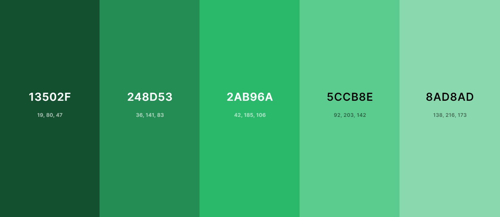

# Second Project Portfolio
    *amiresponisive image*

[View the live project here](https://cilliagustin.github.io/track-e.i/)

## Introduction
The website is a web aplication that allows the user to add any expense or income he/she has and allows them to view all this transaction organized by date and categorized by type of transaction.
The website works with two css files: a general one and one just for the tutorial elements (more of this will be explained later on this file) and 3 javascript files: the first one to change the website look and filter information, the second one to create the data that the used adds, manipulate it and populate the DOM with it and the third one to create the tutorial.

### Purpose
#### For the creator:
* To be able to show the creator capabilities, creating a complex and dinamic website with out the use of any framework or library, creating from scratch pie charts using svg on html and replicating (smaller scale versions) of libraries.

#### For the user:
* To be able to correcly track their transactions in order to keep a better control of their finances.
* To be able to see in an organized list the order oh how each transaction was made.
* To be able to keep in control how the user spends most of their money as well as to be able to track how they earn the most.

## UX
The website is a landing page that consists of the sections:
* Balance Section
* Calendar Section
* Add Section

The site has on top a navbar that allows the use to toggle in between this three sections unless the user is using the website on a desktop. In that case the Add Section is always displayed at the right half of the screen and the navbar allows you to toggle the left half between the Balance and Calendar Sections.

### User Stories

#### New User Goals
* As a new user, I want to be able to intuitively navegate though the website.
* As a new user, I want to have a walkthough that explains me in detail how to use the website.
* As a new User, I want the website to be correctly designed to catch my attention.

#### Current User Goals
* As a current user, I want the website to store my information so I dont have to add it each time I use the website 
* As a current user, I want to be able to see the information I added organized and displayed in a clear way.
* As a current user I want to be able to delete information in case I made a mistake.

### Colour Scheme
The website uses three color schemes: Neutral, Expenses and Incomes.

#### Neutral

View Palette

Is the one used in most of the website design as well as on the calendar section, it appears as default whenever a user opens the website and also when the Balance or Add Section are opened.

#### Expenses

View Palette

This Palette is applied to the Balance and Add section when the expense button is pressed.

#### Pie-chart expense

View Palette

This Palette is applied to the pie chart in balance section when the expense button is selected.

#### Pie-chart highlight expense

Pie-chart Expense Highlight

This colour is applied to the pie chart when one element of the expense type is highlithed, the non-highlighted elements have their brightness lowered to give a better contrast.

#### Incomes

Income Palette

This Palette is applied to the Balance and Add section when the income button is pressed.

#### Pie-chart income 

Donut-chart Income Palette

This Palette is applied to the pie chart in balance section when the income button is selected.

#### Pie-chart highlight income 

Pie-chart Income Highlight

This color is applied to the pie chart when one element of the income type is highlithed and the others are, just like in the expense case, darkened by lowering the brightness.

### Typography
The idea of the website was to have a modern, yet,  design. The typographies selected for this were [Quicksand](https://fonts.google.com/specimen/Quicksand) and [Roboto](https://fonts.google.com/specimen/Roboto) with a backup of Sans-serif. 
Quicksand was used for most of the website and Roboto was used for the navbar, the percentage elements (The menu that appears on Balance Section with transaction information), the category selectors and the submit button in the Add Section.

### Wireframes
The website was coded with the wireframes previously created in mind, although some changes were made during the coding phase and now the website present some slight changes compared to the skeleton.
The wireframes were drawn using [Balsamiq](https://balsamiq.com/), the key for this aplication was provided by [Code Institute](https://codeinstitute.net/global/).

Mobile Wireframe

Tablet Wireframe

Desktop Wireframe

## Features
The website is a landing page divided in three sections. the first time the user uses it they will have to start in the Add Section. Loading here the transaction information will  trigger lots of function which will populate the website´s sections.

### Existing Features
#### Navbar
The navbar is located in the top of the website occupying 100% of the width. On the right side are located the links that toggle the different sections: Balance, Calendar and Add (Only the first two are visible on desktop mode).
Next to the links is a hamburger menu which unfolds a dropdrown menu, here are two Select tag where the user can choose what kind of currency and decimal separator they want to use.
    
    Add navbar images

#### Balance Section
In this section the data is processed and expressed organized by transaction type (Income/Expense) and category.

View Balance Section

#### Pie Chart and Balance
In the Balanse Section, at the top are located both the Pie chart and the final balance. Both Are presented with a 0 value but once the user adds more and more information this are dinamically populated.
The Pie chart, ehich is refered as a Donut Chart on the walkthrough because of how it looks for the user, is created with SVG elements in HTML. This take what percentage each category takes and using some math to calculate the rotation and the starting point of each SVG (each category creates it`s own SVG element and locates it on top of the other using absolute positioning) There is a posibility to highlight a specific element but this will be explained later on.
The balance is located on top of the chart (giving it an appearance of a donut chart) here the total incomes and total expenses are added and bellow them a balance of these two. On top of this is dinamically created another element called selected element which will be explained in the next feature.

View Piechart and Balance (neutral/income/expense)

#### Income Expense Buttons (Balance)
This buttons filter the elements shown according to the category selected and add a specific styling to the section changing its colours.

View Income Expense Buttons (neutral/income/expense)

#### Pie Chart Info
This area will look empty when the website is opened but if an income or expense button are pressed this will filter the correct elements that will appear in here, this elements are called percentage elements.
This display either income or expense transaction with an icon, the category the total value and the percentage. If any of this elements is clicked or hovered will trigger a function that changes the appearence, highlight the pie chart and creates the prevoiusly said "Selected element" which will display the information of the highlighted "percentage element"

View Pie Chart Info (income/expense)

#### Calendar Section
The calendar section appears as blank when first opening it but that is because it´s whole content is created with the user´s data. 
Originally this section consists of a container and an unordered list, once populated this will have a nested list where the first li elements will be dates (with the final balance of that date) and the inner list will be all the transactions that happened on those days.

View Calendar Section

#### Delete Transaction
Each transaction li element will have a div with all the information (category, note, amount) At the end will be a cross icon that if pressed will delete this transaction from the data and repopulate the dom with the new information.

View Delete Transaction

#### Add Section
This is the only section that does not change when the new information is added. This section is always visible and located in the right falf of the screen when the vewport width is bigger than 767px.

View Add Section

#### Input Container
Here are located the four input required for adding new information. The first three (Amount, note and date) are compleated normally with certain restrictions: The amount must be at least 1 cent and will be rounded to have only 2 decimals, the note has a max-value of 20 characters and the date must be between january the fist of 20222 and the current date.
To complete the last input (category) this must be dinamically selected from the options in the category container, this will be explained bellow.

View Input Container (neutral/income/expense)

#### Income Expense Buttons (Add)
Just like in the Balance Section there are 2 buttons located at the end of the container. When these are pressed the section colour changes and the below container (the category container will be populated the different categories availables for incomes or expenses)

View Income Expense Buttons (neutral/income/expense)

#### Category Container
This div (Which looks blank in the beggining) is populated when the income/expense buttons are pressed. When this happens the correct radio button labels are unhidden and allows the user to select it loading it´s value on the category input.

View Category Container (income/expense)

#### Submit Button
This is the button that triggers the main function of the website. It only works when the 4 inputs are correctly completed and send all the information to populate the DOM.

View Submit Button (neutral/income/expense)

#### Footer
This is located at the bottom of the website and has two links (one to my GitHub profile and one to send me an email) and a button that starts the tutorial

View Footer

    
#### Tutorial Button
This button is located at the right corner of the footer and starts a tutorial of the website. When this is pressed the DOM will be repopulated with data so the user can see how to use all the features the website offers.

View Tutorial Button

#### Confirmation Pop up
This Pup Up appears to confirm when a transaction has been correctly added. when this happens a modal will appear for 3 seconds and will automatically be deleted, it can also be deleted by pressing the X icon on the top right corner.

View Confirmation Pop up

#### Error Pop up
This Pup Pp appears when the user has entered into landscape mode with a small phone. Since the website does not look proper on those cases this Pop up hides the entire website and request the user to use the phone on vertical mode.

View Error Pop up

### Features Left to Implement
* To be able to filter the balance by Month
    * This would allow the user to have a better control of their finances and compare their expenses with previous months.
* Add a button to edit a specific transaction.
    * This would allow the to change a transaction if they made an error insted of deleteing and createing the transaction again.

## Technologies Used
### Main Languages Used
* [HTML](https://en.wikipedia.org/wiki/HTML)
* [CSS](https://en.wikipedia.org/wiki/CSS)
* [JavaScript](https://en.wikipedia.org/wiki/JavaScript)

### Other technologies Used
I aplied for the website some technologies that are beyond the scope of what Code Institute teaches:
* Flexbox
* CSS Grid
* Root variables
* HTML SVG

### Javascript
This website has three Javascript files: script.js, data-control.js and tutorial.js. Here it will be explained how these files work and their functions.

#### script.js
This is the first file, here all the variables from the Dom are created. This files is the one where most of the DOM mnipulation happens (resize, filter information, change sections, etc)
* Navbar Functions:
    * The first function is in charge of toggeling the sections. Since the website is a landing page is has only one HTML file when clicking a navbar link there is no loading of a new page. It simple hides all sections, shows the correct one and adds the active class to the corresponding nav link. It also makes sure to refresh the balance section (deletes income or expense class and hides the percentage elements) and does the same with the Add section unless the website is on a desktop. Since in a big device the Add section is always located on the right side, when changing between the Balance and the Calendar Section the Add Section keeps it´s information and does not refresh (It does though if is on a tablet or a phone)
    * The next two functions are very similar, these functions are triggered when the decimal or the currency selector change their values. This functions change the global variable selectedCurrency or selectedDecimal, add to the local storage the values and replace the DOM with the selected currency or decimal separator.
* Resize Functions:
    * The first function makes sure the body height is equal to the screen inner height and triggers when the website loades and when the windor resizes. This was created because using 100 vh in CSS was not working correctly in all browsers and this makes sure there is no overflow.
    * The next function makes sure that the website looks correcly when changing window with. originally if the add section was the active one on a phone, when going to a with higher that 767px it would only show this section and not the balance or calendar (The left side would look empty) to avoid this this function was created which makes sure that when the website width goes from less than 766px to more when the add section is on will show the balance section and give this link the active class. 
    It also makes sure that if the website goes from a desktop width to less than 767px it will refresh the information on the Add section.
    * Since the website does not look properly on a phone on landscape mode a function is created to make sure it send an alert if that happens. The function will trigger if the user is using a device with a width higher than the height, a height less of 500px and a difference between width and height over 200px(The reason of this last condition is that when the user has to write on a phone the keyboard resizes in some browsers so this makes sure when this happens the function does not trigger)
    The alerts is a Pop up dinamically created which cast a shadow on the website and pops a modal that tells the user to use the phone on vertical mode, once this conditions are no longer fullfilled the pop up will be deleted.
* Balance Section Functions:
    * The first function is triggered with the Income/Expense buttons. This adds the correct style to the section and filter the pie chart and percentage elements to show the selected ones.
    * The function Highlight Element is triggered when the mouse hovers over a percentage element or the pie chart or when these are clicked. This adds an active class to the target percentage element, gives an active class to the pie chart section that corresponds to that selected element and gives an unactive class to the other SVG elements, finally it creates an element called selected element which displays the information selected on top of the pie chart result div.
    If the funtion is triggered with the svg elements this will also scroll the pie chart info div to show the target element.
    * Create Selected Elements is the function used on highlight element to create a div with the information of the target.
    * Delete highlight makes sure to delete the active and unactive elements from the svg and pie chart info and deletes the select element. this triggers before the highlight element to avoid class overlapping and also triggers if clicked outside the percentage element and the SVG.
* Add Section functions:
    * The first function triggers with the Income/Expense buttons, just like in the Balance Section this changes the style of the section, filter the category container to show the desired options and deletes the value on the category container
    * The next function takes the value from the selected element in the category container and adds it to the category input.
    * The following function makes sure the input amount has an active class when there is content on the input. The reasor for this is that sometimes when using diferent decimal separator "," or "." the input did not take the result as valid so this makes sure the style is applied correctly.
    * Then there is a function to close manually the confirmation pop up if desired. This pop up will be explained on the data control description.
    * The next funtion sets the input amount to always have 2 decimals.
    * The last of the Add functions sets the input date max value to be the current day value.
* helper functions:
    * Delete Active: deletes the active class in an array of elements.
    * Hide elements: Adds hide class in an array of elements.
    * Delete Values: deletes the element values in an array of elements, this was used to delete input values when refreshing the add section.
    * uncheck radio buttons: adds a false value to checked on array of elements.

#### data-control.js
This is the main JavaScript file and is where all the data is created, manupulated and where the information populates the DOM. The file starts with some variables that will be changed with the following functions.
* The first function is triggered with the submit button on the Add Section. In order to work the 4 inputs must be correctly filled:
    * The function creates variables for the information the user just added: Amount, Note, Category and Date. 
    * Then some functions that manipulate the data and that will be explained later are triggered and stores the created data on the local storage. 
    * After this the balance section is refreshed to show the values just added: The add/Income class are added, the percentage elements and piechart is filtered to show the correct values. This happens so if the user is using a desktop and both the Balance and Add Sections are visible the user automatically sees the new transactions added.
    * Then a Pop Up is created using some helper functions. This pop up confirms the transaction and is deleted automatically in 3 seconds but the user can choose to close it with the X icon.
* The create data function creates an object with the values provided in the prevoius function + a time stamp and the transaction type(this is taken from the add section class that can be either income or expense). This object is then pushed to the data object.
* The group by and sort obj are the next 2 functions to trigger. this work together. the first one takes an array of objects and grupes it into an object with some parameter as key, in this case is the date, then the sort obj function arranges this object by date (from newest to oldest) This 2 functions return an object where each key is a date and inside there is an array for each transaction made in that day, this object is assigned to the dataByDate variable.
* Populate calendar takes the information from the dataByDate object. This function simply loops inside the object and the inner object, takes the data and uses this to create the nested list that is used to populate the calendar section. The timestamp is used in the transaction div as part of the id in order to easily target the element and delete it, this will be explained later on.
* The create balance data takes the data array and divedes it into two creating both and income object and an expense object. These are nested objects where the key is the category and the value is another object with the sum of all transactions of that specific category as the amount key and the percentage it occupies as the other value. Here a helper function called sortBalanceObj is used and this sort the object by the percentage value from higher to lower.
* The function populate balance loops through both income and expense data objects and uses this information to dinamically create all SVG elements and percentage elements. This function also populates the pie chart result div to show the total of the income and expenses as well as the final balance. After this function ends the DOM is fully populated and the main function continues to refresh the balance section, create the pop up, etc.
* The is a function that can be trigered by pressing the X icon on a date elements in the Calendar Section. When this happens the timestamp is taken from the ID of the date element. Then the data array is looped to look for a transaction with that specific timestamp and is deleted and the new array is stored in local storage. After that the prevous functions are re-triggered: group by and sort obj, populate calendar, create balance data and populate calendar.
* Finally the function get data is triggered whenever the page is loaded. This takes the data array from the local storage and re-triggers the functions to populate the DOM. It also takes the selected decimal and selected currency from the local storage and applies them.

#### tutorial.js
The following script file is the last one, this is heavily inspired on how Intro.js. The functions here do not only highlight a selected element, but also populate the DOM with some example transactions and trigger certain functions to show the user all the features of the site.
The script beggins declaring some variables like all the text that will be introduced in the modal, variables like tutorialIndex which will be defined later and some dummy data that will populate the DOM during the walkthrough.
* The first function to work is start tutorial. this is triggered with the question icon in the footer and has certain functions:
    * Populates the DOM with dummy content.
    * Creates a "courtain" that displays a dark overlay on the website
    * Creates a modal that starts the description of the website and centers it
    * Refresh the Dom deleting if the Add or Balance section had an income or expense class and deletes if any input has any value charged.
* Change tutorial step is triggered by clicking the previous or next buttons located in the modal:
    * The first thing that happens is that tutorial index decreaces or increments, this takes from the tutorial content array the section that should be shown with the show tutorial section function, but this will be explained later.
    * After that the function check if there are any previous nhighlited elements and delete the highlight and the inner text of the modal is selected from the tutorial content array and changed.
    * The next part is a witch case with all the possible steps of the tutorial. Since in almost every step of the tutorial there is something that must be toggled (open the submenu in the navbar, add values to the inputs, give income or expense class to section and deleting this, etc) this switch case mas sure to activate and delete all this functionalities when necesary
    * The last functionality searches the element that should be highlited by searching for an element with the "data-tutorial-step" property and giving it a class of tutorial step that raises them up from the overlay.
* The end tutorial function triggers when clicking the X icon on the modal or clicking outside from it.
    * This deletes the background and modal.
    * Refresh the DOM to delete any style that might have been added during any step of the tutorial (Opened the submenu, added classes to sections, etc)
    * Repopulate the DOM with the users data.
    * Goes back to the balance section
* The rest of the functions are helper function that are used to avoid repeating so much code:
    * The center modal is a function that as the title says, locates the modal in the exact center of the website. This function is used on the first and last step of the tutorial and when the walkthrough should highlight a whole section.
    * Locate modal is used in every step of the tutorial and indicates where should the modal be located (Except for the first and last step) when this function is called it looks for the current highlithed elements and tracks their location respect to the screen. Then it calculates if it has more space on top, bottom left or right and located the modal accordingly. If a whole section is being highlited it will call the center modal function. This function is also called every time the website resized to make sure the modal is always correcly positioned.
    * The show tutorial section selects from the tutorial content array what section should be shown in each step and using a switch case makes sure that the correct section is opened and the correct navlink is active. This section also is triggered when reisizng to make sure that if someone goes with a device that is bigger that 767px to a smaller size this does not keep showing the Balance Section that is visible on desktops when the Add Section should be visible.
    * The populate tutorial function populates the DOM with the dummy data. This does not only reuse the populate calendar function, create balance data function, etc. It also adds to the dinamically created elements the "data-tutorial-step" property to the dinamically elements that should be highlithed in the tutorial. This function does not only activates when the start tutorial function is activated but also during the change tutorial step function because during the walkthrough some data will be added and the repopulates with the tutorial data 2 array, which is the same as the first but with a new transaction added.
    * Show add expense and reset add section functions are used in the switch statement of the change tutorial step function.This adds the expense style to the add section and deletes it when necessary.
    * The same way works the Show balance expense and reset section functions that add style and reset the Balance Section when triggered in the switch case.
    * The create highlight piechart function is also triggered in the switch case when the walkthough shows how the piechart works. This is used to create a dummy selected element div and gives the highlighted piechart element an active class and an unactive to the rest.
    * The final function scroll to element makes sure to scroll the pie chart info div to show the bills element that is located at the bottom.

## Testing
Testing information can be found in a separate testing [file](TESTING.md "Link to testing file")
## Deployment
    document all necessary steps you did in order to deploy this project (GitHub Pages, Heroku, etc.)
### Local Deployment
    document all the necessary steps someone else can take in order to make a local copy of your project, like cloning, forking, etc.
## Credits
* [Monefy](https://monefy.me/) was my main inspiration gow how the data should be displayed to the user and how they can interact with it.
* [Intro.Js](https://introjs.com/) was the inspiration of how the tutorial should work. I opened the tutorial on their website and using developer tools realized how their css classes interact and refactor that into my own website.
### Content
* [SVG Pie Chart Code Along](https://www.youtube.com/watch?v=XEUCs7Sh8FI&ab_channel=Sparkbox)
    * Took inspiration of how to create an svg piechart but had to make some tweaks to be able to add many sections to a piechart
* [Animated Toast Notification with Progress Bar in HTML CSS & JavaScript](https://www.youtube.com/watch?v=sTL7KCOf3kg&t=890s&ab_channel=CodingLab)
* [Attach event to dynamic elements in javascript](https://stackoverflow.com/questions/34896106/attach-event-to-dynamic-elements-in-javascript)
    * Taken inspiration for using event delegation on dinamically created elements.
* [Implement Group By Using Reduce](https://www.youtube.com/watch?v=iBGUyPwm_dM&t=417s&ab_channel=SplainTrain)
    * Implemented this function to group the data array into a nested object.
* [How to Sort JavaScript Object by Key](https://www.w3docs.com/snippets/javascript/how-to-sort-javascript-object-by-key.html)
    * This snipped was used to create the sort obj function but it was slightly modified to be sorted in reverse.
* [Convert YYYY-MM-DD to MM/DD/YYYY format in JavaScript](https://bobbyhadz.com/blog/javascript-convert-yyyy-mm-dd-to-mm-dd-yyyy)
    * Used to format the date string but changed to have date formated as DD/MM/YYYY.
* [Iterating Through an Object with `forEach()`](https://masteringjs.io/tutorials/fundamentals/foreach-object)
    * To Learn how to use a for each in an object.
* [Sort objects of objects by nested property](https://stackoverflow.com/questions/48409741/sort-objects-of-objects-by-nested-property)
    * Got inspiration from this answer to create the sort balance obj function.
* [How LocalStorage and Event Delegation work](https://www.youtube.com/watch?v=YL1F4dCUlLc&ab_channel=WesBos)
    * To learn how to use Local Storage.

### Frameworks, Libraries & Programs Used
*   [Google Fonts](https://fonts.google.com/)
    * Used to import fonts.
*   [Font Awesome](https://fontawesome.com/)
    * Used to add all icons in the website.
*   [Balsamiq](https://balsamiq.com/)
    * Used to create the wireframes.
*   [Git](https://git-scm.com/)
    * Used to deploy through the Gitpod terminal.
*   [GitHub](https://github.com/)
    * Used the GitHub pages to deploy the website.
*   [W3C Markup Validation Service](https://validator.w3.org/)
    * Used to validate HTML.
*   [W3C CSS Validation Service](https://jigsaw.w3.org/css-validator/)
    * Used to validate CSS.
*   [JSHint](https://jshint.com/)
    * Used to validate Javascript.
*   [Microsoft Paint](https://apps.microsoft.com/store/detail/paint/9PCFS5B6T72H?hl=en-us&gl=US)
    * Used to edit the screenshots providided in the README and TESTING files.
*   [Coolors](https://coolors.co/)
      * Used to display palettes used for README file.
*   [Color Shades Generator](https://mdigi.tools/color-shades/#270a34)
      * Used to get different shades of a color, used to create the paleete for the pie chart.
*   [Am I Responsive?](https://ui.dev/amiresponsive)
      * Used to provide responsive screenshots used at the begining of the README file.
### Acknowledgements
    list out any acknowledgements you have, if any... tutor support? fellow Slack student help? spouse, loved one, family member, etc.