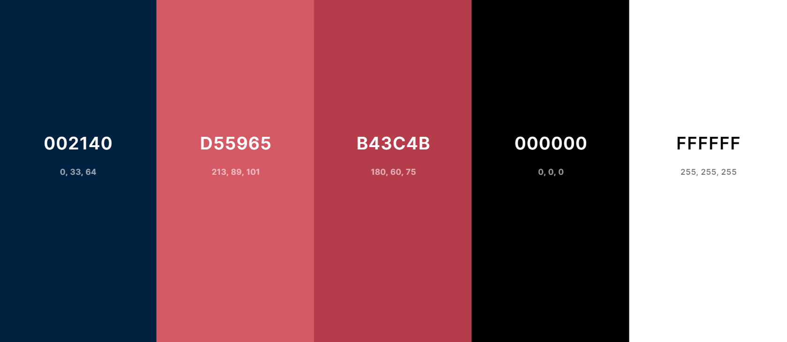

# Second Project Portfolio
    *amiresponisive image*

[View the live project here](https://cilliagustin.github.io/track-e.i/)

## Introduction
The website is a web aplication that allows the user to add any expense or income he/she has and allows them to view all this transaction organized by date and categorized by type of transaction.
The website works with two css files: a general one and one just for the tutorial elements (more of this will be explained later on this file) and 3 javascript files: the first one to change the website look and filter information, the second one to create the data that the used adds, manipulate it and populate the DOM with it and the third one to create the tutorial.

### Purpose
#### For the creator:
* To be able to show the creator capabilities, creating a complex and dinamic website with out the use of any framework or library, creating from scratch pie charts using svg on html and replicating (smaller scale versions) of libraries.

#### For the user:
* To be able to correcly track their transactions in order to keep a better control of their finances.
* To be able to see in an organized list the order oh how each transaction was made.
* To be able to keep in control how the user spends most of their money as well as to be able to track how they earn the most.

## UX
The website is a landing page that consists of the sections:
* Balance Section
* Calendar Section
* Add Section

The site has on top a navbar that allows the use to toggle in between this three sections unless the user is using the website on a desktop. In that case the Add Section is always displayed at the right half of the screen and the navbar allows you to toggle the left half between the Balance and Calendar Sections.

### User Stories

#### New User Goals
* As a new user, I want to be able to intuitively navegate though the website.
* As a new user, I want to have a walkthough that explains me in detail how to use the website.
* As a new User, I want the website to be correctly designed to catch my attention.

#### Current User Goals
* As a current user, I want the website to store my information so I dont have to add it each time I use the website 
* As a current user, I want to be able to see the information I added organized and displayed in a clear way.
* As a current user I want to be able to delete information in case I made a mistake.

### Colour Scheme
The website uses three color schemes: Neutral, Expenses and Incomes.

#### Neutral

View Palette

Is the one used in most of the website design as well as on the calendar section, it appears as default whenever a user opens the website and also when the Balance or Add Section are opened.

#### Expenses

View Palette

This Palette is applied to the Balance and Add section when the expense button is pressed.

#### Pie-chart expense

View Palette

This Palette is applied to the pie chart in balance section when the expense button is selected.

#### Pie-chart highlight expense

Pie-chart Expense Highlight Palette

This Palette is applied to the pie chart when one element of the expense type is highlithed and the others are hidden.

#### Incomes

Income Palette

This Palette is applied to the Balance and Add section when the income button is pressed.

#### Pie-chart income 

Donut-chart Income Palette

This Palette is applied to the pie chart in balance section when the income button is selected.

#### Pie-chart highlight income 

Pie-chart Income Highlight Palette

This Palette is applied to the pie chart when one element of the income type is highlithed and the others are hidden.

### Typography
The idea of the website was to have a modern, yet,  design. The typographies selected for this were [Quicksand](https://fonts.google.com/specimen/Quicksand) and [Roboto](https://fonts.google.com/specimen/Roboto) with a backup of Sans-serif. 
Quicksand was used for most of the website and Roboto was used for the navbar, the percentage elements (The menu that appears on Balance Section with transaction information), the category selectors and the submit button in the Add Section.

### Wireframes
The website was coded with the wireframes previously created in mind, although some changes were made during the coding phase and now the website present some slight changes compared to the skeleton.
The wireframes were drawn using [Balsamiq](https://balsamiq.com/), the key for this aplication was provided by [Code Institute](https://codeinstitute.net/global/).

Mobile Wireframe

Tablet Wireframe

Desktop Wireframe

## Features
The website is a landing page divided in three sections. the first time the user uses it they will have to start in the Add Section. Loading here the transaction information will  trigger lots of function which will populate the website´s sections.

### Existing Features
#### Navbar
The navbar is located in the top of the website occupying 100% of the width. On the right side are located the links that toggle the different sections: Balance, Calendar and Add (Only the first two are visible on desktop mode).
Next to the links is a hamburger menu which unfolds a dropdrown menu, here are two Select tag where the user can choose what kind of currency and decimal separator they want to use.
    
    Add navbar images

#### Balance Section
In this section the data is processed and expressed organized by transaction type (Income/Expense) and category.
   
    Add navbar images

#### Pie Chart and Balance
In the Balanse Section, at the top are located both the Pie chart and the final balance. Both Are presented with a 0 value but once the user adds more and more information this are dinamically populated.
The Pie chart, ehich is refered as a Donut Chart on the walkthrough because of how it looks for the user, is created with SVG elements in HTML. This take what percentage each category takes and using some math to calculate the rotation and the starting point of each SVG (each category creates it`s own SVG element and locates it on top of the other using absolute positioning) There is a posibility to highlight a specific element but this will be explained later on.
The balance is located on top of the chart (giving it an appearance of a donut chart) here the total incomes and total expenses are added and bellow them a balance of these two. On top of this is dinamically created another element called selected element which will be explained in the next feature.

    Add Pie chart + balance images

#### Income Expense Buttons (Balance)
This buttons filter the elements shown according to the category selected and add a specific styling to the section changing its colours.
    
    Add button images

#### Pie Chart Info
This area will look empty when the website is opened but if an income or expense button are pressed this will filter the correct elements that will appear in here, this elements are called percentage elements.
This display either income or expense transaction with an icon, the category the total value and the percentage. If any of this elements is clicked or hovered will trigger a function that changes the appearence, highlight the pie chart and creates the prevoiusly said "Selected element" which will display the information of the highlighted "percentage element"
    
    Add Pie Chart Info images

#### Calendar Section
The calendar section appears as blank when first opening it but that is because it´s whole content is created with the user´s data. 
Originally this section consists of a container and an unordered list, once populated this will have a nested list where the first li elements will be dates (with the final balance of that date) and the inner list will be all the transactions that happened on those days.
    
    Add Calendar images

#### Delete Transaction
Each transaction li element will have a div with all the information (category, note, amount) At the end will be a cross icon that if pressed will delete this transaction from the data and repopulate the dom with the new information.
    
    Add Calendar cross icon images

#### Add Section
This is the only section that does not change when the new information is added. This section is always visible and located in the right falf of the screen when the vewport width is bigger than 767px.
    
    Add Add Section images

#### Input Container
Here are located the four input required for adding new information. The first three (Amount, note and date) are compleated normally with certain restrictions: The amount must be at least 1 cent and will be rounded to have only 2 decimals, the note has a max-value of 20 characters and the date must be between january the fist of 20222 and the current date.
To complete the last input (category) this must be dinamically selected from the options in the category container, this will be explained bellow.
    
    Add Input Container images

#### Income Expense Buttons (Add)
Just like in the Balance Section there are 2 buttons located at the end of the container. When these are pressed the section colour changes and the below container (the category container will be populated the different categories availables for incomes or expenses)
    
    Add Income Expense Buttons images

#### Category Container
This div (Which looks blank in the beggining) is populated when the income/expense buttons are pressed. When this happens the correct radio button labels are unhidden and allows the user to select it loading it´s value on the category input.
    
    Add Category Container images

#### Submit Button
This is the button that triggers the main function of the website. It only works when the 4 inputs are correctly completed and send all the information to populate the DOM.
    
    Add Submit Button images

### Features Left to Implement
    have ideas on what you'd like to add in the future? add them here!! assessors LOVE seeing future concepts!
## Technologies Used
    explain various tech used, such as HTML, CSS, Gitpod, GitHub, Git, etc. - add a link to each respective site as well, if possible
## Testing
    ## Testing
Testing information can be found in a separate testing [file](TESTING.md "Link to testing file")
## Deployment
    document all necessary steps you did in order to deploy this project (GitHub Pages, Heroku, etc.)
### Local Deployment
    document all the necessary steps someone else can take in order to make a local copy of your project, like cloning, forking, etc.
## Credits
    explain about any particular places you took inspiration from
### Content
    list out any URLs or links where you might've borrowed a snippet of code, or element
### Media
    list out any URLs for images/videos/audios you've borrowed from online (Markdown Table works best here!)
### Acknowledgements
    list out any acknowledgements you have, if any... tutor support? fellow Slack student help? spouse, loved one, family member, etc.