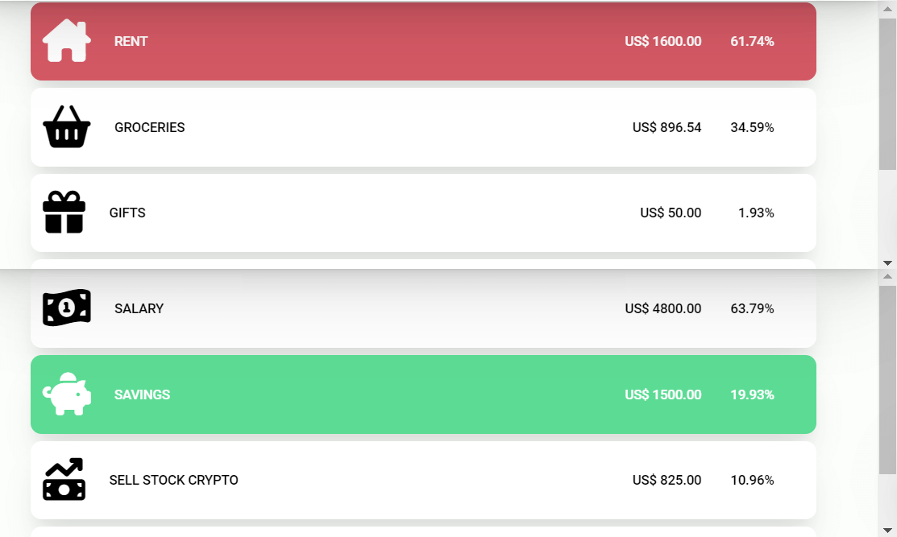

# Testing
"Click to return back to the [README.md](README.md)"
## Browser Compatibility
The site was tested to work correctly in [Google Chrome](https://www.google.com/chrome/), Mozilla [Firefox](https://www.mozilla.org/en-US/firefox/new/) and [Safari](https://www.apple.com/safari/). Here are some screenshots of the site in the different browsers:

Google Chrome

Mozilla Firefox

Safari

## User Stories
Here it will be displayed via screenshots how the different user stories are answered:
### New User Goals
* As a new user, I want to be able to intuitively navigate though the website.
    * The website is intuitive and allows the user to quickly change though the sections.

* As a new user, I want to have a walkthrough that explains me in detail how to use the website.
    * A button that starts the tutorial was created in order to explain correctly how the website works.

* As a new User, I want the website to be correctly designed to catch my attention.
    * The design of the website was created using a lot of colours that represent easily different functions and catches the eye of the user.

### Current User Goals
* As a current user, I want the website to store my information, so I dont have to add it each time I use the website
    * All the information provided by the user (transactions made as well as preference for decimal or currency) are stored and displayed as soon as the user opens the website.
* As a current user, I want to be able to see the information I added organized and displayed in a clear way.
    * All the information can be easily accessed in the calendar and balance section.

* As a current user I want to be able to delete information in case I made a mistake.
    * A delete transaction button is displayed in the calendar section.

## Code Validation
### HTML
Result from [W3C Markup Validation Service](https://validator.w3.org/):

The validator throws two warnings because the sections Balance and Calendar do not use headings. I kept this warnings because after discussing this with my mentor I decided I do not wish to include 2 unnecessary heading for this sections.

### CSS
Since the website has 2 different CSS files each one has been validated.
Result from [W3C CSS Validation Service](https://jigsaw.w3.org/css-validator/) for style.css:

Result from [W3C CSS Validation Service](https://jigsaw.w3.org/css-validator/) for tutorial.css: 

(this was validated by copying and pasting the code directly to the validator)

### JavaScript
Since the website has 3 different JS files each one has been validated.

There are no errors displayed in the validator but it shows different undeclared or unused variables. This happens because most of the variables are declared on the first script file, script.js and are used only on the other files.

Result from [JSHint](https://jshint.com/) for script.js: 

Result from [JSHint](https://jshint.com/) for data-control.js: 

Result from [JSHint](https://jshint.com/) for tutorial.js: 

### Lighthouse
Result from [Lighthouse](https://chrome.google.com/webstore/detail/lighthouse/blipmdconlkpinefehnmjammfjpmpbjk?hl=es):

## Responsiveness
Here are some screenshots of the website in mobile, tablet and desktop version. The website was created using the same breakpoints [Bootstrap](https://getbootstrap.com/) uses: up to 575px for mobile, from 576px to 766px for tablet and at least 767px for desktop.
Here you will find four images on top for the mobile version, one for the desktop on the bottom and four more for tablet on the right side.
More screenshots in desktop version can be found on the screenshots provided for Google Chrome and Mozilla Firefox in the [browser compatibility section](#browser-compatibility):

Responsiveness

## Bugs
During the coding of the page I found two major bugs I had to fix:
* The first one was that the pie chart result div some times showed the final balance in negative although the income was bigger than the expense. This happened because the final balance variable is created by comparing the incomeTotal and expenseTotal variables, if the income is bigger the expense is subtracted and a currency sign is added, otherwise there is a minus sign that is located before the currency sign and then the expense is subtracted from the income. The bug occurred because during the conditional that check if the income or the expense are bigger the variables incomeTotal and expenseTotal are compared as strings instead of numbers so when the function check which variable is bigger it may throw an error. This was fixed by adding a parse float before comparing each value which changes them from a string to a number and the function to stablish correctly which value is bigger.
This bug was originally detected by my mentor during our second call for the project.

View Bug

* The second bug showed a bigger height of the body on different browsers, although the height was set on 100vh in some browsers like mozilla or safari it displayed a body height bigger that the window itself. This was fixed by changing how the height is set, instead of using a CSS rule I created the setheight function that takes the inner height of the window and established that as the body height (more information of this function can be found in the JavaScript description on the README.md file). This function is triggered when the website is loaded and is also retriggered each time the website is resized.

View Bug

* The final bug happened only on safari. In this browser the date input did not take the correct size: a width of 100% of its container. This is because on safari this type of input does not accept correctly the with: 100% value, so I added a min-width property (Which is correctly accepted by the browser) to make sure the div always displays correctly in each browser.

View Bug

## Unfixed Bugs
The only bug I am aware at the publishing moment of writing this file is that for very big numbers, like in the example, the text from the pie chart result div overflows and is also visible when the selected element is on top of it.
This could be fixed by applying a function that could lower the font size according to the amount of characters the  p element has.

View Bug

